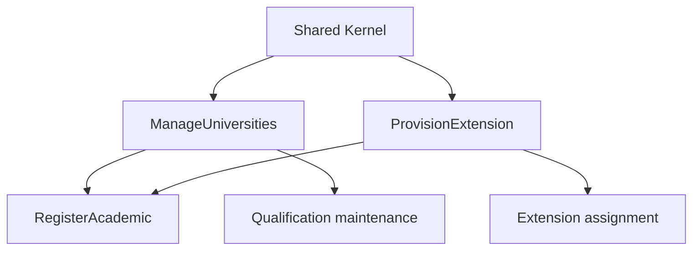

Parts 9 and 10 established the reference-data implementations that Zeus Academia depends on. This post concludes that sequence by showing how to delegate the remaining ManageUniversities and ProvisionExtension slices to specialized subagents and execute them in parallel.

Reference data became infrastructure as soon as another workflow depended on it. University codes and extension numbers therefore had to be treated as durable, verifiable inputs for registration, qualification maintenance, and later reporting.

The [ManageUniversities implementation prompt](.github/prompts/academia-implementation/ep-1-3-manage-universities-implementation.prompt.md) and [ProvisionExtension implementation prompt](.github/prompts/academia-implementation/ep-1-4-provision-extension-implementation.prompt.md) turned that dependency into two bounded vertical slices. Together, they showed how specialized AI subagents could execute repository work without handing the entire feature to one undifferentiated agent.

<!--more-->

<figure>
  
  <figcaption>Phase 1 reference data moved from shared foundations through controlled catalogs and inventory protection.</figcaption>
</figure>

## Why These Two Slices Mattered

Both prompts followed the Shared Kernel and prepared inputs for `RegisterAcademic`, but neither owned the later assignment, qualification, release, or reporting workflows. Their independence made them suitable for parallel delivery, while their invariants made careless parallel edits risky.

| Prompt | Owned | Did not own | Key invariant |
| --- | --- | --- | --- |
| `ManageUniversities` | Add/list university catalog | Qualification assignment and reporting | Canonical, unique university codes |
| `ProvisionExtension` | Provision/deprovision extension pool | Assignment, reassignment, release, and reporting | Unique numeric extensions; assigned extensions cannot be removed |

## What Each Prompt Required

The prompts were deliberately narrow. They described the implementation surface, the evidence required, and the boundary to preserve.

### ManageUniversities

The prompt required an `AddUniversity` command and a `ListUniversities` query with validation, handlers, responses, endpoints, mappings, and tests in the feature/use-case structure. Code trimming, casing, uniqueness, and error messages had to derive from one canonical definition. Invalid input had to identify the `Code` property, duplicates had to fail without partial persistence, and listing had to remain stable. The prompt described add/list behavior, not full CRUD.

### ProvisionExtension

The prompt required provision and deprovision commands. Provisioning accepted numeric values and rejected duplicates. Deprovisioning removed a free extension but protected an assigned one. Tests had to cover both success paths and both guards. Assignment, reassignment, release, and reporting remained separate slices.



The scheduling rule was simple: AI confirmed Shared Kernel availability and separate artifact ownership first, then ran the two tracks concurrently. A subagent inspected existing models, persistence roots, fixtures, and neighboring conventions before changing code.

## How Both Prompts Were Submitted in Parallel

The two slices shared the Shared Kernel but did not depend on each other's records. That made them good candidates for parallel execution, provided the coordinator confirmed the prerequisite first and each implementation agent worked in an isolated branch, worktree, or clearly separated change set. Parallel submission reduced waiting time without creating two agents editing the same files or making incompatible shared-model decisions.

### The prerequisite check was submitted once

Before both prompts were launched, I submitted a short coordination request. Its response became the shared context for the two parallel tracks:

```text
Prepare parallel execution for these prompts:
- .github/prompts/academia-implementation/ep-1-3-manage-universities-implementation.prompt.md
- .github/prompts/academia-implementation/ep-1-4-provision-extension-implementation.prompt.md

Act as slice-coordinator. Confirm that Shared Kernel is available, identify each slice's feature and persistence targets, and verify that the university catalog and extension pool do not already have conflicting models. Return one artifact map per prompt, the route and schema decisions, known blockers, and the files each track may change.

Do not implement either slice yet. The two tracks must remain independently reviewable and must not edit the same file without an explicit coordination decision.
```

If this check found a conflict in the Shared Kernel, persistence root, or existing fixtures, I would need to resolve it before parallel implementation started. If one track was blocked, I paused only that track, recorded the blocker and affected files, and allowed the independent track to continue only when it did not depend on the unresolved decision.

### The two implementation tracks were launched

I opened two separate VS Code agent chats, attached one implementation prompt to each, selected the appropriate custom agent, and provided the coordinator handoff in each initial message. I used isolated branches. The `data-persistence` role was explicit in the university prompt; persistence work for the extension prompt was coordinated through the `slice-coordinator` unless implementation revealed schema-heavy work requiring escalation.

| Parallel track | Agent and scope | Handoff returned |
| --- | --- | --- |
| ManageUniversities | `backend-domain` plus `data-persistence`; add/list behavior, canonical code normalization, and uniqueness | Changed files, API contract, canonical-rule decision, tests, and persistence evidence |
| ProvisionExtension | `backend-domain`; numeric provision/deprovision behavior and the assigned-extension guard | Changed files, API contract, guard decision, tests, and unresolved risks |

Each track had to stay within its approved targets. An agent that needed to change a shared file owned by the other track had to stop and escalate rather than edit through the conflict.

### The tracks were synchronized before final verification

When both agents reported completion, I collected their changed-file lists, contracts, migrations or mapping evidence, test output, and unresolved risks. I did not ask a verifier to inspect two vague “done” messages. I submitted one combined verification request after both tracks were available:

```text
Verify these two completed Phase 1 tracks against their source prompts:
- .github/prompts/academia-implementation/ep-1-3-manage-universities-implementation.prompt.md
- .github/prompts/academia-implementation/ep-1-4-provision-extension-implementation.prompt.md

ManageUniversities handoff:
[paste changed files, API contract, persistence evidence, and test output]

ProvisionExtension handoff:
[paste changed files, API contract, persistence evidence, and test output]

Act as testing-verification. Run focused checks for university add, duplicate rejection, stable listing, numeric extension validation, duplicate provision, free-extension deprovision, and assigned-extension protection. Check that the two tracks do not introduce conflicting shared models, that persistence evidence matches the target provider, and that integration-test cleanup is best effort in finally blocks. Return separate evidence and blockers for each slice, plus any cross-slice issue that must be resolved before RegisterAcademic.
```

This synchronization point preserved independence while still testing the integration boundary. Slice-specific checks could run in parallel, but the final result had to distinguish a verified university catalog from a verified extension pool and had to block both when a cross-slice model conflict remained.

## How Subagents Executed the Prompts

Specialized agents kept each track focused: the coordinator resolved scope and dependencies, implementation agents changed only approved artifacts, persistence support protected durable rules, and verification agents returned evidence. The prompts provided the handoff contract; humans still resolved boundary decisions and reviewed the final result.

## What Good Escalation Looked Like

The prompts included escalation triggers because specialized agents had to stop when a decision changed the slice boundary. Examples included competing university catalogs, unclear extension identity semantics, or an inability to determine whether an extension was assigned.

Escalation had to produce a specific question and the evidence behind it: which files conflicted, which rule was ambiguous, and which implementation choices were affected. A coordinator or human could then decide without reviewing an entire speculative implementation. This was where subagents improved engineering throughput: they reduced mechanical work while preserving a deliberate decision point for choices that needed judgment.

## Final Parallel-Execution Checklist

Before Phase 1 was handed to `RegisterAcademic`, AI confirmed:

- [ ] Shared Kernel dependency had been confirmed
- [ ] Track ownership and file boundaries had been agreed
- [ ] No overlapping edits had remained between tracks
- [ ] Both implementation handoffs had been received
- [ ] Slice-specific tests had passed
- [ ] Cross-slice model conflicts had been checked
- [ ] Human showcase had been completed
- [ ] README and provenance links had been updated

## What's Next?

This post concludes the reference-data implementations. Now that ManageUniversities and ProvisionExtension have been verified, `RegisterAcademic` can consume canonical university codes and a protected extension pool, while later slices own assignment, reassignment, release, and qualification behavior.

The larger lesson was that subagents work best when prompts described collaboration rather than merely output. These two Phase 1 prompts made that operating model concrete: bounded slices were delegated, independent work was run in parallel, and evidence was required before the next phase began.

## Feedback Loop

Feedback is welcome at [john.miller@codemag.com](mailto:john.miller@codemag.com).

## Disclaimer

AI contributed to this post, but humans reviewed and refined it.

Authoring prompts used for this post:

- "write a blog post explaining the #file:ep-1-3-manage-universities-implementation.prompt.md prompt and the #file:ep-1-4-provision-extension-implementation.prompt.md prompt. include ian explaination for using subagents to execute both prompts"
- "add to the blog post the instructions for submitting the prompts so that the execute in parallel"
- "The prompts that blog instructions are referring to are the prompts used to create and modify the blog posts, not the implementation prompts that are the subject of the blog post. Update the blog post instructions to make this clear."
- "Update the README link so it matches the article’s current ai_log value."
- "Keep How to Submit Both Prompts in Parallel as the primary operational section. Reduce How Subagents Execute the Prompts to one short paragraph explaining the role of specialized agents."
