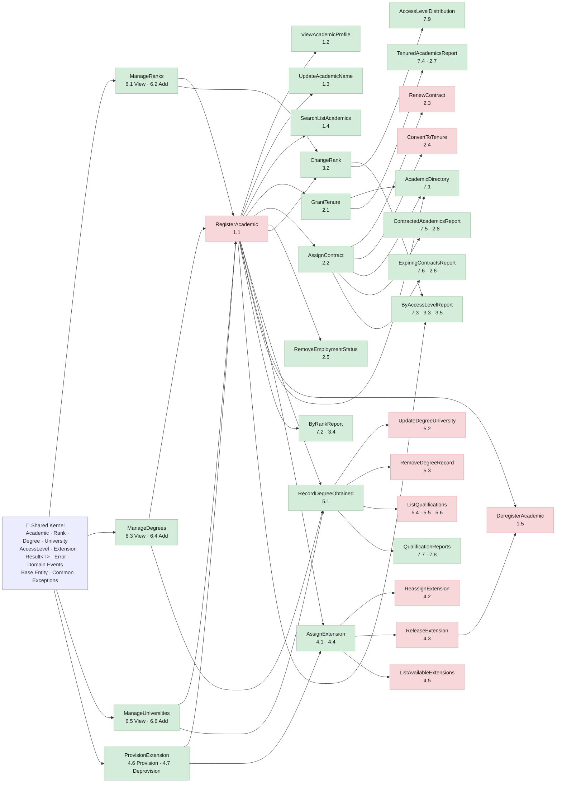

# Zeus Academia — Vertical Slice Implementation Plan

**Source documents:**

- Workflows: `models/workflows/academia-workflows.md`
- Business rules: `models/orm/academia.txt`
- Architecture standards: `.github/instructions/vertical-slice-implementation.instructions.md`

---

## Slice Dependency Diagram

---

> **Diagram key:** 🟢 Green — no peer dependency; once its own prerequisites are met it can run concurrently with other green slices.
> 🔴 Red — a specific predecessor slice must complete before this one can start.

---

## Shared Kernel

**Goal:** Establish domain primitives used across all slices. No HTTP endpoints. Must be in place before any slice work begins.

| Artifact                    | Description                                                                  | Business Rule                                                             |
| --------------------------- | ---------------------------------------------------------------------------- | ------------------------------------------------------------------------- |
| `Academic` entity           | `empNr` (6-char fixed), `EmpName` (≤15 var), `IsTenured`, `ContractEndDate?` | empNr is identifier; ExclusiveOr constraint: tenured XOR contracted       |
| `Rank` value object         | Enum: `P`, `SL`, `L`                                                         | Exactly one per Academic; determines AccessLevel                          |
| `AccessLevel` value object  | Enum: `INT`, `NAT`, `LOC`; derived from Rank                                 | P→INT, SL→NAT, L→LOC; never set directly                                  |
| `Degree` value object       | Code (e.g. `PHD`, `MCS`, `BSc`)                                              | —                                                                         |
| `University` value object   | Code (e.g. `UCSD`, `MIT`)                                                    | —                                                                         |
| `Extension` value object    | Numeric decimal; unique per Academic (1:1)                                   | extNr; each Academic uses exactly one; each Extension used by at most one |
| `AcademicQualification`     | Composite: Academic + Degree + University                                    | One University per Academic+Degree pair; Academic must have ≥1            |
| `Result<T>` / `Error`       | Operation outcome wrapper                                                    | —                                                                         |
| `StudentEnrolledEvent` base | `IDomainEvent` interface + dispatcher                                        | —                                                                         |
| Common exceptions           | `NotFoundException`, `ConflictException`, `BusinessRuleViolationException`   | —                                                                         |

**Acceptance Criteria:**

- [ ] All entity/value object types compile with nullability enabled
- [ ] ExclusiveOr constraint (`IsTenured` and `ContractEndDate` cannot both be set) enforced in `Academic` aggregate
- [ ] `AccessLevel` is read-only, computed from `Rank`
- [ ] `Result<T>` covers Success and Failure paths
- [ ] Unit tests confirm ExclusiveOr rule and AccessLevel derivation

---

## Slices

| Slice                             | Workflow(s)   | Type            | Blocked By                                                         | Key Business Rules                                                                                  |
| --------------------------------- | ------------- | --------------- | ------------------------------------------------------------------ | --------------------------------------------------------------------------------------------------- |
| **ManageRanks**                   | 6.1, 6.2      | Command + Query | —                                                                  | Values restricted to P, SL, L; must include AccessLevel mapping; code unique                        |
| **ManageDegrees**                 | 6.3, 6.4      | Command + Query | —                                                                  | Code unique                                                                                         |
| **ManageUniversities**            | 6.5, 6.6      | Command + Query | —                                                                  | Code unique                                                                                         |
| **ProvisionExtension**            | 4.6, 4.7      | Command         | —                                                                  | `extNr` numeric decimal; cannot deprovision if assigned to Academic                                 |
| **RegisterAcademic**              | 1.1           | Command         | ManageRanks, ManageDegrees, ManageUniversities, ProvisionExtension | `empNr` 6-char unique; `EmpName` ≤15 chars; ≥1 Degree+University pair; Extension must be unassigned |
| **ViewAcademicProfile**           | 1.2           | Query           | RegisterAcademic                                                   | Returns empNr, name, rank, derived AccessLevel, extension, degrees, employment status               |
| **UpdateAcademicName**            | 1.3           | Command         | RegisterAcademic                                                   | `EmpName` ≤15 chars; uniqueness not enforced                                                        |
| **SearchListAcademics**           | 1.4           | Query           | RegisterAcademic                                                   | Filter by name, rank, access level, employment status, degree, university; paginated                |
| **GrantTenure**                   | 2.1           | Command         | RegisterAcademic                                                   | Sets `IsTenured = true`; clears `ContractEndDate`; ExclusiveOr enforced                             |
| **AssignContract**                | 2.2           | Command         | RegisterAcademic                                                   | Sets `ContractEndDate`; clears `IsTenured`; date must be future; ExclusiveOr enforced               |
| **RenewContract**                 | 2.3           | Command         | AssignContract                                                     | Replaces `ContractEndDate`; Academic must already be contracted; new date must be future            |
| **ConvertContractToTenure**       | 2.4           | Command         | AssignContract                                                     | Academic must be contracted; clears date; sets tenured                                              |
| **RemoveEmploymentStatus**        | 2.5           | Command         | RegisterAcademic                                                   | Clears both `IsTenured` and `ContractEndDate`                                                       |
| **ChangeRank**                    | 3.2           | Command         | RegisterAcademic, ManageRanks                                      | New rank must be valid code; `AccessLevel` recalculated automatically; `RankChangedEvent` raised    |
| **RecordDegreeObtained**          | 5.1           | Command         | RegisterAcademic, ManageDegrees, ManageUniversities                | Duplicate Academic+Degree pair rejected                                                             |
| **UpdateDegreeUniversity**        | 5.2           | Command         | RecordDegreeObtained                                               | `AcademicQualification` record must exist                                                           |
| **RemoveDegreeRecord**            | 5.3           | Command         | RecordDegreeObtained                                               | Academic must retain ≥1 degree after removal                                                        |
| **ListQualifications**            | 5.4, 5.5, 5.6 | Queries         | RecordDegreeObtained                                               | By academic, by degree code, by university code                                                     |
| **AssignExtension**               | 4.1, 4.4      | Command + Query | RegisterAcademic, ProvisionExtension                               | Extension must be provisioned and unassigned                                                        |
| **ReassignExtension**             | 4.2           | Command         | AssignExtension                                                    | Source extension released first; target must not already hold one                                   |
| **ReleaseExtension**              | 4.3           | Command         | AssignExtension                                                    | Extension returned to available pool                                                                |
| **ListAvailableExtensions**       | 4.5           | Query           | AssignExtension                                                    | Returns provisioned Extensions not currently assigned                                               |
| **DeregisterAcademic**            | 1.5           | Command         | RegisterAcademic, ReleaseExtension                                 | Publishes `AcademicDeregisteredEvent`; retains degree history                                       |
| **AcademicDirectory**             | 7.1           | Query           | RegisterAcademic                                                   | Full listing: name, rank, access level, extension, employment status                                |
| **ByRankReport**                  | 7.2, 3.4      | Query           | RegisterAcademic                                                   | Count + list per rank; include derived AccessLevel                                                  |
| **ByAccessLevelReport**           | 7.3, 3.3, 3.5 | Query           | ChangeRank                                                         | Count + list: INT / NAT / LOC                                                                       |
| **TenuredAcademicsReport**        | 7.4, 2.7      | Query           | GrantTenure                                                        | Filter `IsTenured = true`; include rank and qualifications                                          |
| **ContractedAcademicsReport**     | 7.5, 2.8      | Query           | AssignContract                                                     | Filter `ContractEndDate != null`; sort ascending                                                    |
| **ExpiringContractsReport**       | 7.6, 2.6      | Query           | AssignContract                                                     | Filter `ContractEndDate ≤ today + threshold`; configurable window (default 90 days)                 |
| **QualificationReports**          | 7.7, 7.8      | Queries         | RecordDegreeObtained                                               | By degree grouped; by university grouped; counts                                                    |
| **AccessLevelDistributionReport** | 7.9           | Query           | ChangeRank                                                         | Count per AccessLevel (INT / NAT / LOC)                                                             |

---

## Shared Kernel Boundary

Promote to `src/backend/SharedKernel/` upfront:

| Type                                         | Rationale                                            |
| -------------------------------------------- | ---------------------------------------------------- |
| `Academic` aggregate + `empNr` value object  | Identity used in every slice                         |
| `Rank` enum + `AccessLevel` derivation logic | Required by Register, ChangeRank, all reports        |
| `Degree` + `University` value objects        | Required by Register, RecordDegree, all qual reports |
| `Extension` value object                     | Required by Register, all extension slices           |
| `Result<T>` / `Error`                        | Used by every handler                                |
| `IDomainEvent` + dispatcher                  | Used by ChangeRank, Deregister                       |
| `NotFoundException`, `ConflictException`     | Used across commands                                 |

Do **not** promote: response DTOs, validators, endpoint-specific types.

---

## Business Rule Enforcement Summary

| Rule                                                                       | Enforced In                                                                  | Slice                                |
| -------------------------------------------------------------------------- | ---------------------------------------------------------------------------- | ------------------------------------ |
| `empNr` is 6-char fixed                                                    | `RegisterAcademicCommandValidator`                                           | RegisterAcademic                     |
| `EmpName` ≤15 chars                                                        | `RegisterAcademicCommandValidator`, `UpdateAcademicNameCommandValidator`     | RegisterAcademic, UpdateAcademicName |
| Rank ∈ {P, SL, L}                                                          | `RegisterAcademicCommandValidator`, `ChangeRankCommandValidator`             | RegisterAcademic, ChangeRank         |
| AccessLevel derived from Rank; never set directly                          | `Academic` aggregate property                                                | Shared Kernel                        |
| IsTenured XOR ContractEndDate (never both)                                 | `Academic.SetTenured()`, `Academic.SetContract()` guard methods              | Shared Kernel                        |
| Academic must have ≥1 Degree+University                                    | `RegisterAcademicCommandValidator`, `RemoveDegreeRecordHandler` domain guard | RegisterAcademic, RemoveDegreeRecord |
| Academic+Degree pair maps to at most one University                        | `RecordDegreeObtainedHandler` duplicate check                                | RecordDegreeObtained                 |
| Extension is 1:1 with Academic (unique per Academic, unique per Extension) | `AssignExtensionHandler` uniqueness check                                    | AssignExtension                      |
| ContractEndDate must be future                                             | `AssignContractCommandValidator`, `RenewContractCommandValidator`            | AssignContract, RenewContract        |
| Cannot deprovision assigned Extension                                      | `DeprovisionExtensionHandler` guard                                          | ProvisionExtension                   |

---

## Rollout Notes

- **Shared Kernel** must be in place before any slice work begins; no UI required.
- **ManageRanks**, **ManageDegrees**, **ManageUniversities**, **ProvisionExtension** carry no UI requirement; seed via migration or admin API.
- **RegisterAcademic** is the minimum viable slice for any UI work to begin — unblock it first.
- **Reporting** slices should use dedicated read-optimised projection queries; do not reuse command-side aggregate loading.
- **ExclusiveOr constraint** must be verified by integration tests before **GrantTenure**, **AssignContract**, or **RemoveEmploymentStatus** ship to production.
- **Extension uniqueness** must be enforced at the database level (unique index on `ExtensionId` FK) in addition to handler guards.
